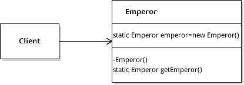
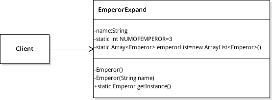
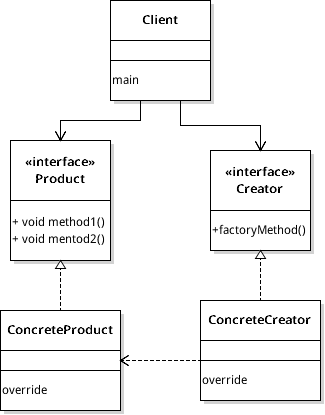
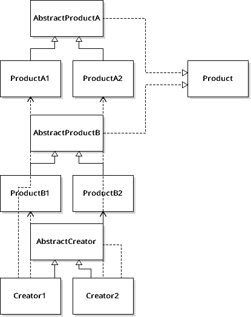
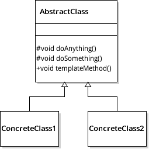
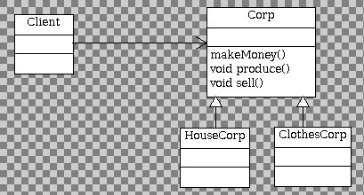
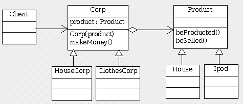
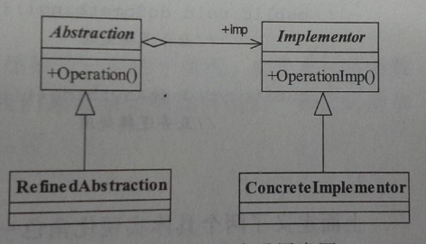

# DesignMode
0、设计模式的六大原则
------------
* 单一职责原则：接口要做到职责单一，类的设计尽量做到只有一个原因引起变化
* 里氏替换原则：所有引用基类的地方必须能透明地使用其子类对象，换言之，在类的设计中要做到拥抱抽象，这样的设计理念可以很大的降低类之间的耦合关系
* 依赖倒转原则：模块之间依赖通过抽象发生，实现类之间不发生直接的依赖关系，其依赖关系通过接口或抽象类产生
* 接口隔离原则：保证接口的纯洁性，建立单一的接口原则，具体而言就是提供给每个模块的都应该是单一接口，提供给几个模块就应该有几个接口，而不是建立一个庞大的臃肿的接口，容纳所有的客户端访问
* 迪米特法则：最少知识原则，一个对象应该对其他对象有最少的了解，通俗的讲，一个类应该对自己耦合或调用的类知道的最少，更明确的说法是，当一个类与其他类耦合时，只需要持有该类对象应用即可，该类的具体实现不要出现在类中
*  开闭原则：对扩展开放、对修改关闭一个软件实体应该通过扩展来实现变化，而不是通过修改已有的代码来实现变化

1、单例模式
------------------------
**概念：要求一个类只能产生一个实例**

UML类图：

优点：内存开辟小，有效的避免资源的多重占用

缺点：扩展困难

使用场景：产生的单例的全局特性，在一些项目中需要一个共享访问点或共享数据

**扩展**：产生固定数量个实例对象，类图如下：

2、工厂方法模式
---------------------------
**概念**：定义一个用户创建对象的接口,让子类决定实例化哪个类

UML类图：

优点：扩展性好，产生对象是很容易扩展的

使用场景：工厂模式的主要核心理念是提供便利的方式动态适配的产生对象，一些场景中需要灵活、可扩展框架，灵活产生对象，可以使用工厂模式

3、抽象工厂模式
------------------------
**概念**:抽象工厂方法是工厂方法的升级版本,在有多个业务种类时，通过抽象模式产生需要的对象是一种非常好的解决方法

UML类图：

4、模板方法模式
--------------------
**概念**：定义一个算法的框架，而将一些步骤延迟到子类中，使得子类可以不改变一个算法的结构即可重新定义该算法的某些特定步骤

如下图：AbstractClass成为抽象模板，其方法主要分为两类：
	* 基本方法：由子类实现的方法，并且在模板方法中调用
	* 模板方法：一个框架，包含一个或几个具体方法，实现对基本方法的调度，完成逻辑，一般而言，模板方法都加上final关键字，不允许被重写，子类只需要重写具体方法即可

UML类图:

优点：封装不变部分，扩展可变部分；提取公共代码，便于维护；子类实现父类的基本方法，可以扩展自己的方法

1、桥接模式 BridgePattern
----------------
* 实例(公司盈利)
 (1)UML类图如下图所示:
 
 
 (2)浅谈这种设计的特点:
 	- 拥抱抽象，Corp使用的是一个抽象类，不论在何时，我们要扩展派生其他的公司类都是很方便的：不过此处若使用接口来实现则会更优
 	- 类职责定位不明确，举个例子，如果某天提出一个需求服装公司类要改为生产手机产品,那么类结构如是设计很难应对这种需求，或许你可能会说，直接派生类Telephone，但是如果说要生产电脑、汽车。。等等，这样做的结果无疑是产生一大堆的公司类，而实际正真需要的产品,产品和公司关系耦合的太死了

* 对类进行重新设计

  (1)改进后的UML类图
  
  (2)改进后的公司类，实现了公司与具体产品的接偶，由此启发：在进行类的设计过程中，要注意拥抱抽象(依赖倒置原则)
  * 模块直接的依赖通过抽象发生，实现类之间尽量不要发生直接的依赖关系，依赖关系通过接口或抽象发生
  * 接口或抽象不依赖于现实类
  * 实现类依赖于抽象或接口

2、桥梁模式总结
* 概念:将抽象与现实接偶，使得二者可以独立进行变化
* 模型图
 
* 角色 具有的角色:抽象化角色->Abstraction	具体抽象化角色->RedefineAbstraction  
实现化角色->Implementor  具体实现化角色->ConcreteImplementor

2、享元模式
--------------------
